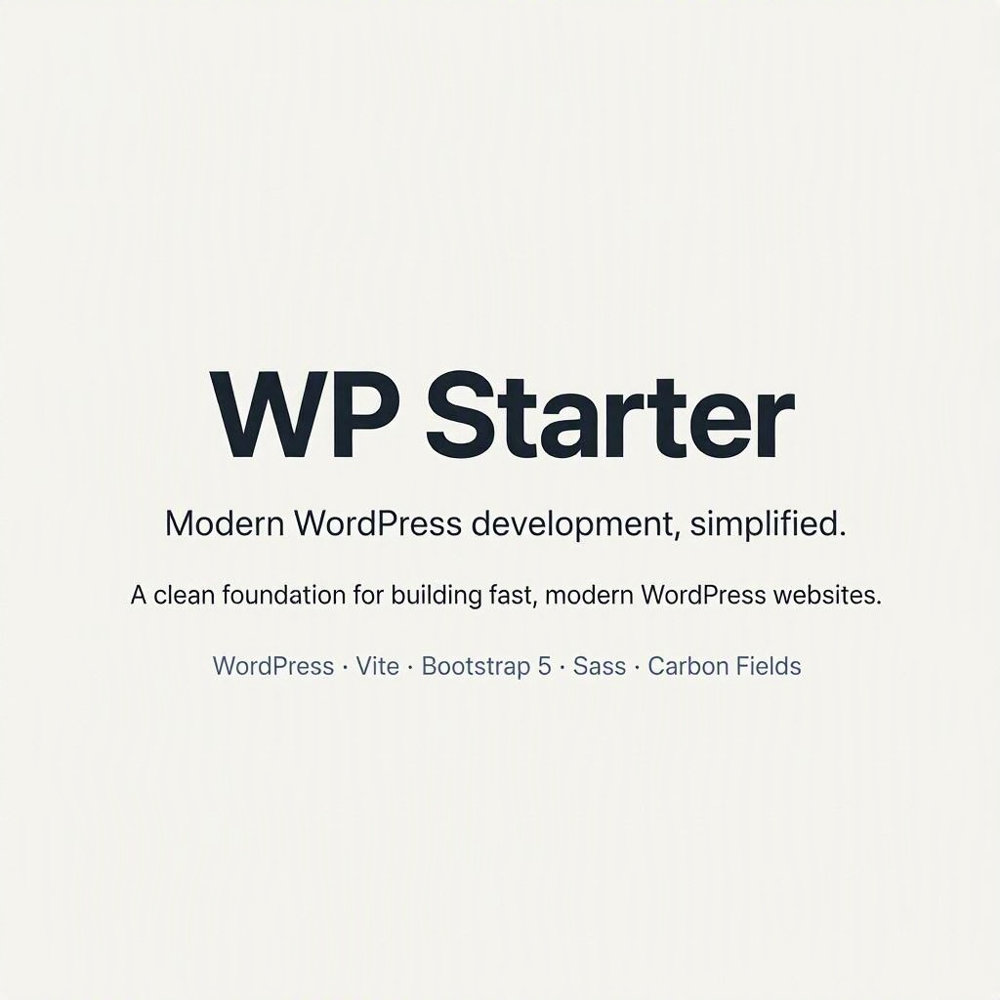

# WP Starter

A lightweight, production-ready WordPress starter theme built with **Vite**, **Bootstrap 5**, **Sass**, and **Fontsource**.

The theme is designed as a clean foundation for custom WordPress projects without unnecessary dependencies or page-builder overhead.



## Features

- WordPress theme development with modern PHP
- Vite-powered development workflow
- Bootstrap 5.3
- Sass support
- Roboto and Roboto Condensed via Fontsource
- Vite HMR during development
- Automatic PHP Live Reload
- Production asset manifest
- Minified production JavaScript
- Automatic removal of development `console` statements
- WordPress editor styles
- Custom logo support
- Primary and footer navigation menus
- Widget/sidebar support
- Responsive embeds
- HTML5 theme support
- Accessible skip-to-content link
- Semantic navigation markup
- Carbon Fields compatibility helpers
- Clean development/production asset separation

## Requirements

- PHP 8.1+
- WordPress 6.x+
- Node.js 20+
- npm
- Composer
- A local WordPress development environment

## Installation

From the theme directory:

```bash
composer install
npm install
npm run build
```

Then activate **WP Starter** in WordPress or with WP-CLI:

```bash
wp theme activate wp-starter
```

## Development

Start the Vite development server:

```bash
npm run dev
```

Vite runs on:

```text
http://127.0.0.1:5173
```

When WordPress is running in a local/development environment, the theme automatically uses the Vite development server when it is available.

This provides:

- Vite HMR for JavaScript and CSS
- PHP Live Reload
- Development versions of assets
- Fast frontend iteration

The theme falls back to the production build automatically when the Vite server is unavailable.

## Production Build

Build optimized production assets with:

```bash
npm run build
```

The production files are generated in:

```text
dist/
```

The build creates a Vite manifest at:

```text
dist/.vite/manifest.json
```

WordPress uses this manifest to load generated JavaScript and CSS files.

Production JavaScript is minified with Terser and `console` statements are removed during the build.

## Available Scripts

| Command | Description |
|---|---|
| `npm run dev` | Start the Vite development server |
| `npm run watch` | Build assets in watch mode |
| `npm run build` | Create the production build |

## Asset Workflow

The theme has two asset modes.

### Development

When the WordPress environment is `local` or `development` and Vite is available, WordPress loads the Vite client and application entry point from `127.0.0.1:5173`. This enables HMR, PHP Live Reload, and fast frontend iteration.

### Production

When Vite is not available, WordPress loads the files generated in `dist/` using `dist/.vite/manifest.json`. This keeps development tooling out of the production asset workflow.

## Project Structure

```text
wp-starter/
├── inc/
│   ├── carbon-fields.php
│   ├── enqueue.php
│   ├── helpers.php
│   ├── head.php
│   └── setup.php
├── resources/
│   ├── js/
│   │   ├── app.js
│   │   └── editor.js
│   └── scss/
│       ├── _variables.scss
│       ├── _gutenberg.scss
│       ├── app.scss
│       └── editor.scss
├── template-parts/
│   ├── content.php
│   └── post-meta.php
├── archive.php
├── front-page.php
├── footer.php
├── functions.php
├── header.php
├── index.php
├── page.php
├── search.php
├── single.php
├── sidebar.php
├── theme.json
├── package.json
├── vite.config.js
└── README.md
```

## JavaScript

The main frontend entry point is `resources/js/app.js`. The block editor entry point is `resources/js/editor.js`. Bootstrap JavaScript is loaded through the main application entry point.

## CSS and Sass

The main stylesheet is `resources/scss/app.scss`. Bootstrap is imported through Sass, allowing Bootstrap variables and components to be customized before compilation.

The editor stylesheet is `resources/scss/editor.scss`.

### Typography

The theme uses:

- **Roboto** for body text
- **Roboto Condensed** for headings and display typography

Fonts are bundled through Fontsource rather than loaded from an external CDN. This keeps font assets under the theme's build pipeline and avoids unnecessary third-party font requests.

## Native Gutenberg Support

The theme keeps WordPress core block markup and behavior intact. It does not convert blocks to Bootstrap grid markup or replace the native block editor.

The `theme.json` file defines these layout defaults:

- **Content width:** 760px
- **Wide width:** 1200px
- **Default block gap:** 1.5rem
- **Spacing presets:** 0.5rem, 1rem, 1.5rem, 2rem, and 3rem

These settings provide native width and spacing controls for blocks such as Group and Columns, including the Wide alignment option. Actual layout still depends on the alignment and layout settings selected for each block in the editor.

Minimal compatibility styles for core blocks are maintained in `resources/scss/_gutenberg.scss`. The same partial is imported by both frontend and editor Sass so the Outline button style and basic image/embed sizing remain consistent. Validate frontend/editor parity after changing theme styles or adding plugins.

## WordPress Setup

Theme initialization is handled by `inc/setup.php`.

The theme enables:

- `title-tag`
- `post-thumbnails`
- `custom-logo`
- HTML5 markup
- responsive embeds
- editor styles

The theme registers:

- Primary Menu
- Footer Menu
- Main Sidebar

## Front Page Template

The `front-page.php` template supports both WordPress homepage modes:

- **A static front page:** renders the selected page's title and content.
- **Your latest posts:** renders the main post query with pagination and the sidebar.

Choose the desired mode under **Settings → Reading** in WordPress. The template uses the main query, so WordPress pagination and the configured posts-per-page setting remain in effect.

## Template Parts and Post Listings

Archive, index, search, and latest-posts templates share the markup in `template-parts/content.php`. It uses semantic article markup and a small set of Bootstrap utilities; it does not enforce a card design or a multi-column post grid. Change the markup or add a Bootstrap component at project level when the design calls for it.

Date and category metadata is shared through `template-parts/post-meta.php`, which is also used by the single-post template. These two template parts exist to avoid duplicating markup that is used in multiple places.

## Helpers

Reusable theme helpers are located in `inc/helpers.php`.

Examples include:

```php
wp_starter_asset()
wp_starter_carbon_theme_option()
wp_starter_carbon_post_meta()
wp_starter_posts_pagination()
```

The Carbon Fields helpers safely return default values when Carbon Fields is not available.

Archive, index, and search templates use `wp_starter_posts_pagination()` to render WordPress pagination with Bootstrap 5 `pagination`, `page-item`, and `page-link` classes. The helper uses WordPress `paginate_links()` rather than implementing pagination logic itself.

## Carbon Fields

Carbon Fields is an optional extension for projects that need custom fields. Install it through Composer when required:

```bash
composer require htmlburger/carbon-fields
```

The theme checks for the Composer autoloader before booting Carbon Fields. Safe wrappers are available for theme options and post metadata:

```php
wp_starter_carbon_theme_option()
wp_starter_carbon_post_meta()
```

When Carbon Fields is installed, the starter currently registers these example fields:

### Theme Options

Available under **Appearance → Theme Options**:

- Phone
- Email
- Footer text
- Footer logo

### Post Fields

For standard posts:

- Subtitle
- Hero image

Remove or adapt these example fields for each client project.

## Head Optimization

Basic WordPress-generated head noise is removed in `inc/head.php`. The theme intentionally keeps functionality that can be useful for feeds, REST discovery, and plugin compatibility.

## Accessibility

The starter includes accessibility-oriented defaults such as semantic HTML, accessible navigation labels, keyboard-accessible mobile navigation, a skip-to-content link, responsive layout, and editor styles matching frontend typography. Accessibility should still be validated on the final project because content, plugins, and custom components can introduce additional issues.

## Performance

Production builds provide minified JavaScript, bundled CSS, local font assets, content-hashed Vite output, and manifest-based asset loading. Additional optimization should be applied at project level depending on content, images, plugins, hosting, and caching.

## Production Checklist

Before deployment:

```bash
composer install --no-dev --optimize-autoloader
npm install
npm run build
```

Then verify:

- WordPress loads without PHP errors
- Navigation menus work
- Custom logo works
- Featured images work
- Responsive layouts work
- Editor styles are correct
- Production assets load from `dist/`
- Browser console contains no unexpected errors
- Forms and interactive components work
- Accessibility has been checked
- Lighthouse has been reviewed
- Cache/CDN configuration is enabled where appropriate

## Important

The following directories are normally ignored by Git:

```text
vendor/
node_modules/
dist/
```

If the deployment environment does not run Node.js, deploy the generated `dist/` directory as part of the release.

## Development Philosophy

This starter intentionally avoids unnecessary abstractions and fixed design decisions.

The goal is to provide:

1. A clean WordPress foundation
2. Bootstrap 5 for layout utilities and components when needed
3. A modern Vite/Sass build system
4. Gutenberg for editing page content
5. Optional Carbon Fields for project-specific custom fields
6. Predictable development and production behavior
7. Easy customization for client projects

WordPress templates control page structure and content. Bootstrap supports the chosen design; it does not dictate it. The theme is a foundation to extend, not a finished design system.

## License

WP Starter is licensed under the GNU General Public License v2 or later. See [LICENSE](https://www.gnu.org/licenses/gpl-2.0.html) for the license terms.
